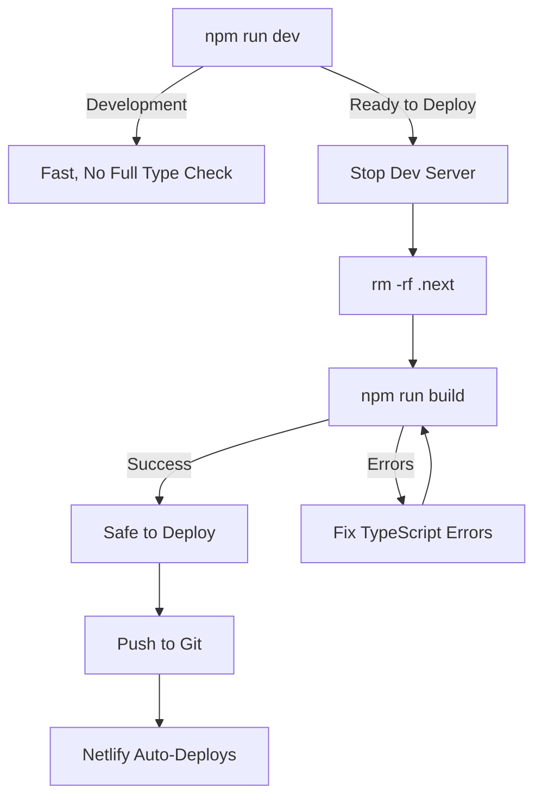

# Local Build Process - Catch Errors Before Netlify

## Why Build Locally?

**Next.js dev mode (`npm run dev`) does NOT catch all TypeScript errors!**

Dev mode uses Turbopack which:
- ✅ Compiles files on-demand (fast)
- ❌ Doesn't type-check entire codebase
- ❌ Only shows errors when you visit specific pages

**Netlify runs `npm run build` which**:
- ✅ Type-checks ALL files
- ✅ Catches errors in unvisited pages
- ✅ Same process as production build

## How to Build Locally

### 1. Stop Dev Server
```bash
# Kill all Node processes (or just close the terminal running npm run dev)
pkill -9 node

# Or more targeted:
lsof -ti:3010 | xargs kill -9
```

### 2. Clear Build Cache
```bash
rm -rf .next
```

### 3. Run Production Build
```bash
npm run build
```

This command runs:
1. `prisma generate` - Generates Prisma Client
2. `next build` - Full TypeScript type checking + bundling

### 4. Fix Errors
If build fails, you'll see TypeScript errors like:
```
Failed to compile.

./app/admin/users/page.tsx:198:24
Type error: Property 'avatar' does not exist on type '...'
```

Fix each error and re-run `npm run build`.

## Common Build Errors We Found

### 1. Missing Schema Fields
```typescript
// ❌ Field doesn't exist in Prisma schema
user.avatar

// ✅ Use correct field name
user.profileImage
```

### 2. Removed Neighborhood Fields
```typescript
// ❌ Old flat structure (removed)
neighborhood.city
neighborhood.state

// ✅ New normalized structure
neighborhood.city.name
neighborhood.city.state.name

// ✅ With null safety
neighborhood.city?.name || 'N/A'
```

### 3. Invalid Prisma orderBy
```typescript
// ❌ Can't orderBy nested relations
orderBy: [{ state: 'asc' }, { city: 'asc' }, { name: 'asc' }]

// ✅ Simple orderBy
orderBy: [{ name: 'asc' }]
```

### 4. Missing AgentCommission Fields
```typescript
// ❌ These fields don't exist
{
  percentage: 15,
  orderAmount: 1000,
  status: 'PENDING'
}

// ✅ Only use fields that exist in schema
{
  agentId: agent.id,
  orderId: order.id,
  amount: commissionAmount,
  type: 'ORDER_COMMISSION'
}
```

## Build Process Workflow



## Complete Build Script

Save this as `scripts/build-local.sh`:

```bash
#!/bin/bash

echo "🛑 Stopping dev servers..."
lsof -ti:3010 | xargs kill -9 2>/dev/null
pkill -9 -f "next dev" 2>/dev/null

echo "🧹 Clearing build cache..."
rm -rf .next

echo "🏗️  Running production build..."
npm run build

if [ $? -eq 0 ]; then
  echo "✅ Build successful! Safe to deploy."
  exit 0
else
  echo "❌ Build failed. Fix errors above."
  exit 1
fi
```

Make it executable:
```bash
chmod +x scripts/build-local.sh
```

Run it:
```bash
./scripts/build-local.sh
```

## Integration with Git Workflow

### Option 1: Manual Check (Current)
```bash
# Before pushing to Git
npm run build

# If successful
git add .
git commit -m "Your message"
git push
```

### Option 2: Git Pre-Push Hook (Automated)
Create `.git/hooks/pre-push`:
```bash
#!/bin/bash

echo "Running pre-push build check..."
npm run build

if [ $? -ne 0 ]; then
  echo "❌ Build failed! Push cancelled."
  echo "Fix errors and try again."
  exit 1
fi

echo "✅ Build passed! Proceeding with push."
```

Make executable:
```bash
chmod +x .git/hooks/pre-push
```

Now `git push` will automatically run `npm run build` and block the push if it fails!

## Errors Fixed in This Session

| File | Error | Fix |
|------|-------|-----|
| `app/admin/users/page.tsx` | `user.avatar` doesn't exist | Changed to `user.profileImage` |
| `app/agent/application/page.tsx` | `maxFixers`/`maxClients` don't exist | Removed non-existent fields |
| `app/agent/application/page.tsx` | `neighborhood.city` possibly null | Added `?.` null safety |
| `app/agent/clients/new/page.tsx` | Invalid orderBy `state`/`city` | Changed to `orderBy: [{ name: 'asc' }]` |
| `app/agent/fixers/new/page.tsx` | Invalid orderBy `state`/`city` | Changed to `orderBy: [{ name: 'asc' }]` |
| `app/profile/page.tsx` | Invalid orderBy `state`/`city` | Changed to `orderBy: [{ name: 'asc' }]` |
| `app/api/admin/disputes/[disputeId]/resolve/route.ts` | `order.orderNumber` doesn't exist | Changed to `orderId` |
| `app/api/admin/orders/[orderId]/settle/route.ts` | `percentage`/`orderAmount`/`status` don't exist | Removed non-existent fields |

## Best Practices

1. **Always run `npm run build` before pushing to Git**
2. **Never rely on dev mode to catch all errors**
3. **Fix build errors immediately - don't accumulate them**
4. **Use TypeScript strict mode** (already enabled in this project)
5. **Check Prisma schema before accessing fields**

## Quick Reference

| Command | Purpose |
|---------|---------|
| `npm run dev` | Development (fast, incomplete type checking) |
| `npm run build` | Production build (full type checking) |
| `rm -rf .next` | Clear build cache |
| `pkill -9 node` | Stop all Node processes |
| `npx prisma generate` | Regenerate Prisma Client after schema changes |

---

**Remember**: `npm run build` is your safety net. Use it before every deployment!
